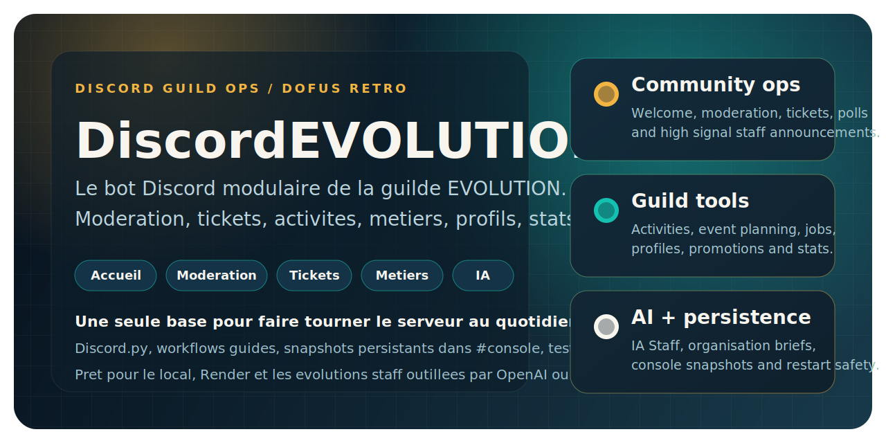
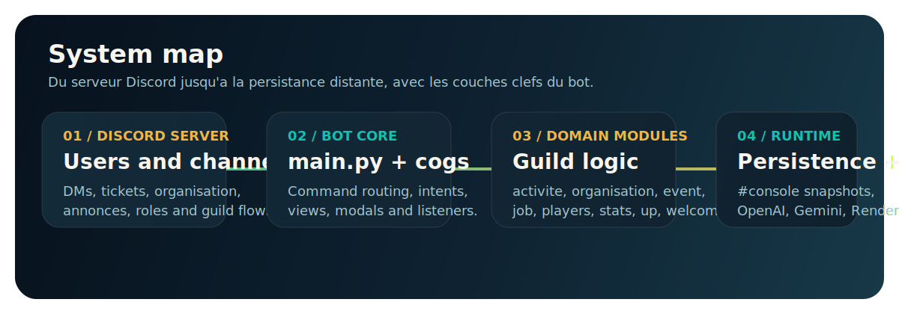

<p align="center">
  
</p>

<p align="center">
  <strong>Le bot Discord modulaire de la guilde EVOLUTION sur Dofus Retro.</strong><br>
  Accueil, moderation, tickets, activites, metiers, profils, stats et assistants IA dans une seule base de code robuste.
</p>

<p align="center">
  <a href="#demarrage-rapide"><strong>Demarrage rapide</strong></a>
  |
  <a href="#panorama"><strong>Panorama</strong></a>
  |
  <a href="#architecture"><strong>Architecture</strong></a>
  |
  <a href="#commandes-cles"><strong>Commandes cles</strong></a>
  |
  <a href="#qualite"><strong>Qualite</strong></a>
</p>

<p align="center">
  <a href="https://github.com/Donj63000/DiscordEVOLUTION/actions/workflows/ci.yml"></a>
  
  
  
</p>

## Panorama

DiscordEVOLUTION centralise les workflows critiques du serveur EVOLUTION dans un bot unique : parcours membres, moderation, tickets, annonces, organisation, metiers, profils, stats et assistance staff outillee par IA.

<table>
  <tr>
    <td width="25%">
      <strong>Community ops</strong><br>
      Welcome, depart, moderation, warnings, tickets, annonces staff et sondages dans une meme couche d'exploitation.
    </td>
    <td width="25%">
      <strong>Guild tools</strong><br>
      Activites, events, jobs, profils, ladder, promotions et stats pour piloter la vie de la guilde.
    </td>
    <td width="25%">
      <strong>AI staff</strong><br>
      <code>!organisation</code> et <code>!iastaff</code> accelerent les briefs, les reponses et certaines actions staff.
    </td>
    <td width="25%">
      <strong>Restart safe</strong><br>
      Les etats critiques sont republies dans <code>#console</code> pour survivre aux redemarrages Render.
    </td>
  </tr>
</table>

> `#console` est la source de verite en production. Les snapshots persistants y sont republies pour que le bot reparte proprement apres un redemarrage.

## Visuel du projet

<p align="center">
  
</p>

<table>
  <tr>
    <td width="33%">
      
      <strong>IA Staff</strong><br>
      Assistant staff capable de guider, raisonner et agir via ses outils quand ils sont actives.
    </td>
    <td width="33%">
      
      <strong>Jobs</strong><br>
      Gestion des metiers et niveaux, consultation par joueur ou par metier.
    </td>
    <td width="33%">
      
      <strong>Parcours membre</strong><br>
      Welcome, entree, sorties et experience serveur plus soignee.
    </td>
  </tr>
</table>

## Parcours clefs

1. Un membre peut ouvrir un ticket, recevoir un accueil propre ou etre modere selon le contexte.
2. Le staff peut preparer une activite avec `!activite`, un event via `!event` ou un brief guide via `!organisation`.
3. Les metiers, profils, promotions et stats restent consultables et persistants dans le temps.
4. Les assistants IA aident le staff a aller plus vite sans sortir du cadre du serveur.

## Architecture

```text
DiscordEVOLUTION/
|-- main.py
|-- activite.py
|-- organisation.py
|-- iastaff.py
|-- event_conversation.py
|-- job.py
|-- players.py
|-- stats.py
|-- up.py
|-- moderation.py
|-- welcome.py
|-- member_guard.py
|-- cogs/
|-- models/
|-- utils/
`-- tests/
```

### Modules qui structurent le bot

| Module | Role |
| --- | --- |
| `main.py` | Bootstrap Discord, chargement des extensions, lock singleton et wiring global du bot. |
| `organisation.py` | Parcours IA pour `!organisation`, pilotage OpenAI et publication dans le salon cible. |
| `iastaff.py` | Assistant staff, configuration du modele, outils, morning greeting et orchestration IA. |
| `event_conversation.py` | Workflow DM de `!event`, drafts, validation et persistance associee. |
| `job.py` / `players.py` / `stats.py` | Donnees de guilde, metiers, profils, recrutement et statistiques. |
| `utils/console_store.py` | Stockage structure via `#console`, charge utile cle pour la reprise apres restart. |
| `tests/` | Couverture Pytest sur le coeur du bot, les cogs, la persistance et les workflows IA. |

## Demarrage rapide

### 1. Cloner le depot

```bash
git clone https://github.com/Donj63000/DiscordEVOLUTION.git
cd DiscordEVOLUTION
```

### 2. Installer les dependances

```bash
pip install -r requirements.txt
```

### 3. Preparer l environnement

Copiez `.env.example` vers `.env` puis renseignez vos secrets.

Variables minimales :

| Variable | Usage |
| --- | --- |
| `DISCORD_TOKEN` | Token du bot Discord. |
| `FERNET_KEY` | Cle de chiffrement pour les donnees sensibles. |
| `OPENAI_API_KEY` | Requise pour `!organisation` et les usages OpenAI. |
| `GOOGLE_API_KEY` | Requise pour les usages Gemini selon le backend choisi. |

Generation rapide de `FERNET_KEY` :

```bash
python -c "from cryptography.fernet import Fernet; print(Fernet.generate_key().decode())"
```

### 4. Lancer le bot

```bash
python main.py
```

## Configuration et persistance

Le projet est pense pour une exploitation reelle sur Discord, pas juste pour du test local.

| Zone | Ce qu il faut savoir |
| --- | --- |
| `#console` | C est la source de verite pour les donnees critiques. Utilisez les helpers de persistance au lieu d inventer des fichiers ad hoc. |
| IA Staff | `IASTAFF_ENABLE_TOOLS=1` permet a l assistant d agir via son catalogue d outils. |
| Organisation | Les variables `ORGANISATION_*` reglent le backend, les timeouts et les parametres de planification. |
| Stockage | `DATABASE_URL` peut etre active pour certains usages, sinon le fallback par console reste la reference. |
| Secrets | Aucun token, cache runtime ou donnees sensibles ne doit etre committe. |

Snapshots locaux typiques :

- `activities_data.json`
- `jobs_data.json`
- `players_data.json`
- `profiles_data.json`
- `promotions_data.json`
- `stats_data.json`
- `warnings_data.json`
- `welcome_data.json`

## Commandes cles

| Commande | Ce que ca fait |
| --- | --- |
| `!ticket <objet>` | Ouvre un ticket prive et organise l echange staff. |
| `!annonce`, `!annoncestaff`, `!sondage` | Gere la diffusion publique, staff et les votes. |
| `!activite` | Lance un workflow de planification d activite. |
| `!organisation` | Produit un brief evenementiel guide par IA. |
| `!event` | Cree un event avec un parcours DM structure. |
| `!job <metier> <niveau>` | Ajoute ou met a jour un metier pour un joueur. |
| `!profil set`, `!profil stats`, `!ladder` | Met a jour les profils et consulte les stats serveur. |
| `!iastaff <message>` | Interagit avec l assistant staff et ses outils. |
| `!warnings`, `!resetwarnings`, `!up` | Gere la moderation et la progression. |

## Qualite

Le depot est outille pour tenir dans la duree :

- CI GitHub Actions sur `push` et `pull_request`
- compilation des sources Python dans la pipeline
- suite `pytest` complete sur les workflows critiques
- tests autour de l IA, de la persistance et des commandes principales

Commande de validation locale :

```bash
python -m pytest
```

## Deploiement

Execution locale :

```bash
python main.py
```

Keep alive / Render :

```bash
gunicorn alive:app --bind 0.0.0.0:$PORT
```

Si besoin, `ALIVE_IN_PROCESS=1` permet de faire tourner le bot et le keep alive dans un meme processus local.

## Contribution

- Travaillez avec des tests qui passent avant chaque push.
- Ajoutez des tests cibles a chaque evolution comportementale.
- Gardez `#console` comme autorite de persistance.
- N ajoutez ni secrets, ni caches, ni exports runtime au depot.

## Licence

Projet distribue sous licence [MIT](LICENSE).
