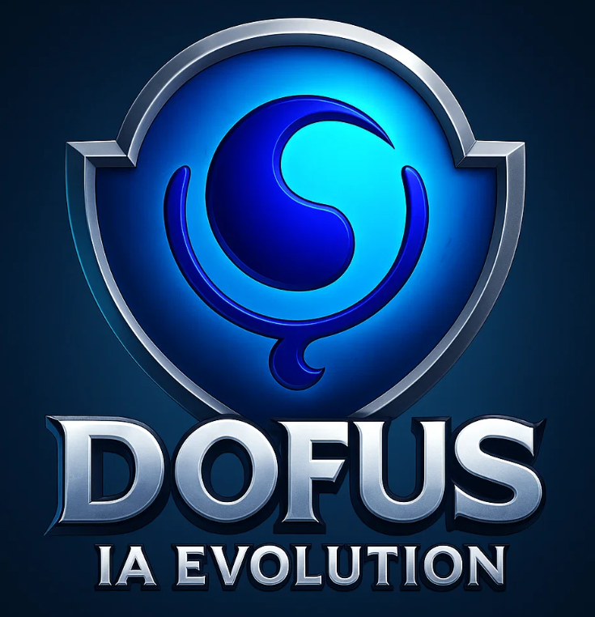
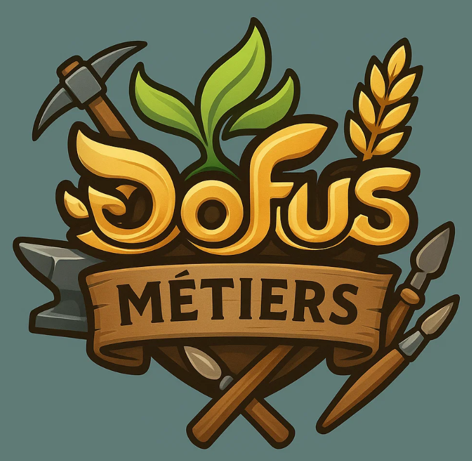
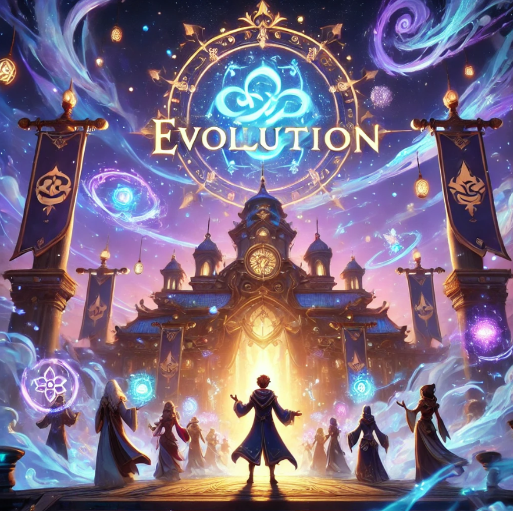

<div align="center">

# DiscordEVOLUTION

<p>
  <strong>Le bot Discord tout-en-un de la guilde EVOLUTION sur Dofus Retro.</strong><br>
  Accueil, modération, tickets, activités, métiers, profils, statistiques et assistants IA dans une seule base de code.
</p>

<p>
  <a href="#installation-rapide">Installation rapide</a> •
  <a href="#fonctionnalités">Fonctionnalités</a> •
  <a href="#architecture">Architecture</a> •
  <a href="#configuration">Configuration</a> •
  <a href="#tests">Tests</a>
</p>

<p>
  
  
  
  
</p>

</div>

---

## Vue d'ensemble

**DiscordEVOLUTION** est un bot Discord complet utilise sur le serveur **EVOLUTION**, une guilde **Dofus Retro**. Il centralise les workflows essentiels du serveur : accueil des membres, moderation, tickets, annonces, gestion des metiers, profils joueurs, organisation d'evenements et assistance IA pour le staff.

Le projet a ete developpe par **Coca**, membre de la guilde Evolution sur Boune, avec une architecture modulaire orientee production et une persistance des donnees pensee pour survivre aux redemarrages de Render.

## Pourquoi ce projet se demarque

- **Experience serveur complete** : un seul bot couvre l'accueil, la moderation, les tickets, l'organisation, les metiers et les statistiques.
- **IA integree au quotidien** : `!organisation` et `!iastaff` exploitent OpenAI pour accelerer les taches staff.
- **Persistance resiliente** : les donnees critiques sont republiees dans `#console` pour resister aux redemarrages de l'hebergement.
- **Base de code testee** : la logique metier est couverte par une suite `pytest` et de nombreux tests cibles.
- **Exploitation flexible** : execution locale simple, hebergement Render et endpoint keep-alive via Gunicorn.

## Fonctionnalites

### Gestion communautaire

| Domaine | Description |
| --- | --- |
| Accueil | Messages de bienvenue et de depart, suivi des membres deja salues, repli en salon public si les DM ne passent pas. |
| Moderation | Detection d'insultes, avertissements, timeouts, reset des sanctions et outils de controle staff. |
| Tickets | Creation de tickets prives pour les membres avec suivi cote staff. |
| Annonces | Publications publiques, staff et sondages avec formats adaptes au serveur. |

### Outils de guilde

| Domaine | Description |
| --- | --- |
| Activites | Organisation d'activites via `!activite` et publication dans les salons dedies. |
| Evenements | Workflow guide en DM avec `!event`, publication dans `#organisation` et persistance associee. |
| Metiers | Enregistrement des metiers et niveaux avec `!job`, consultation par joueur ou par metier. |
| Profils | Fiches joueurs, statistiques, ladder global et filtres par classe. |
| Promotions | Gestion des promotions et de la progression des membres. |
| Statistiques | Suivi d'activite, stockage persistant et commandes de pilotage pour le staff. |

### Assistants IA

| Commande | Role |
| --- | --- |
| `!organisation` | Guide le staff dans la preparation d'un brief d'evenement avec OpenAI. |
| `!iastaff` | Assistant staff capable de raisonner, repondre et, si active, d'utiliser des outils pour agir sur le bot. |
| Syntheses IA | Certaines etapes de resume et de preparation d'evenements utilisent Gemini ou OpenAI selon la configuration. |

## Apercu du projet

### Parcours principaux

1. **Un membre ouvre un ticket** via `!ticket` et le staff le traite dans le salon dedie.
2. **Un organisateur prepare une activite** via `!activite`, `!organisation` ou `!event`.
3. **Le staff consulte ou met a jour les metiers** avec `!job` et les profils avec `!profil`.
4. **Les donnees sont dupliquees dans `#console`** pour garantir la reprise apres redemarrage.
5. **Les assistants IA** accelerent la preparation, l'edition et certaines actions staff.

### Captures du projet

<p align="center">
  
  
  
</p>

## Architecture

### Structure du depot

```text
DiscordEVOLUTION/
├── main.py                 # point d'entree et chargement du bot
├── activite.py             # workflow d'activites
├── organisation.py         # assistant IA d'organisation
├── iastaff.py              # assistant IA staff et outils
├── event_conversation.py   # workflow DM pour !event
├── job.py                  # gestion des metiers
├── players.py              # donnees joueurs et recrutement
├── stats.py                # statistiques et persistance associee
├── cogs/                   # commandes Discord et interfaces metier
├── models/                 # schemas et modeles de donnees
├── utils/                  # persistance, helpers IA, dates, stockage
├── tests/                  # suite de tests pytest
└── examples/               # echantillons JSON anonymises
```

### Modules cles

| Module | Responsabilite |
| --- | --- |
| `main.py` | Initialise le client Discord, charge les modules et relie les services partages. |
| `organisation.py` | Gere le parcours IA de `!organisation` avec OpenAI et les variables `ORGANISATION_*`. |
| `iastaff.py` | Expose l'assistant staff `!iastaff`, les outils IA et le pilotage du modele. |
| `event_conversation.py` | Reste l'autorite pour `!event`, ses DM guides et sa persistance. |
| `utils/console_store.py` | Centralise la sauvegarde distante vers le salon `#console`. |
| `tests/` | Verifie les comportements critiques, notamment les modules IA, les cogs et la persistance. |

## Preparation du serveur Discord

### Roles attendus

- **Staff** pour les commandes d'administration, les tickets et l'orchestration des evenements.
- **Membre valide d'Evolution** pour les commandes reservees a la guilde.
- **Invites / Invite** pour les visiteurs si vous utilisez ce flux.
- **Veteran** pour le module de promotion `up.py`.

### Salons recommandes

- `console` pour la persistance distante.
- `ticket` pour la reception et le traitement des tickets.
- `annonces` pour les annonces et sondages.
- `organisation` pour les activites et evenements.
- `𝐆𝐞́𝐧𝐞́𝐫𝐚𝐥` comme fallback si les DM echouent.
- `𝐑𝐞𝐜𝐫𝐮𝐭𝐞𝐦𝐞𝐧𝐭` pour les entrees et sorties.
- `𝐁𝐢𝐞𝐧𝐯𝐞𝐧𝐮𝐞` pour l'accueil.
- `𝐆𝐞́𝐧𝐞́𝐫𝐚𝐥-staff` pour certains votes staff.
- `xplock-rondesasa-ronde` pour les annonces de PL.

### Permissions conseillees

- **Gerer les evenements**.
- **Gerer les roles**.
- **Envoyer** et **gerer les messages**.
- Acces aux **messages prives**.
- Une position suffisante dans la hierarchie des roles.

## Installation rapide

### 1. Cloner le depot

```bash
git clone <votre-url-du-repo>
cd DiscordEVOLUTION
```

### 2. Installer les dependances

```bash
pip install -r requirements.txt
```

### 3. Configurer l'environnement

Creez un fichier `.env` avec les secrets adaptes a votre serveur.

### 4. Lancer le bot

```bash
python main.py
```

## Configuration

### Variables minimales

| Variable | Description |
| --- | --- |
| `DISCORD_TOKEN` | Token du bot Discord. |
| `FERNET_KEY` | Cle de chiffrement pour certaines donnees et URL. |
| `GOOGLE_API_KEY` | Requise pour les flux Gemini utilises par certaines fonctionnalites. |

Generation rapide de `FERNET_KEY` :

```bash
python -c "from cryptography.fernet import Fernet; print(Fernet.generate_key().decode())"
```

### Variables IA et options avancees

| Groupe | Variables |
| --- | --- |
| OpenAI | `OPENAI_API_KEY`, `OPENAI_STAFF_MODEL`, `OPENAI_ORG_ID`, `OPENAI_FORCE_ORG` |
| IA Staff | `IASTAFF_ENABLE_TOOLS` et les variables `IASTAFF_*` |
| Organisation | variables `ORGANISATION_*` |
| Stockage | `DATABASE_URL` si PostgreSQL est utilise |
| Profil / Score | `PROFILE_*`, `SCORE_*`, `PROFILE_SCORE_WEIGHTS` |

## Persistance et sauvegardes

La persistance locale repose sur plusieurs fichiers JSON generes a l'execution, puis synchronises vers **`#console`**, qui fait foi en production.

### Fichiers de donnees courants

- `activities_data.json`
- `jobs_data.json`
- `players_data.json`
- `promotions_data.json`
- `stats_data.json`
- `warnings_data.json`
- `welcome_data.json`

### Principe de sauvegarde

- Le bot maintient des caches locaux pour fonctionner rapidement.
- Les etats critiques sont republies dans `#console` afin de survivre aux redemarrages Render.
- Des exemples anonymises sont fournis dans le dossier [`examples/`](examples/).
- Les donnees runtime ne doivent pas etre committees dans Git.

## Commandes cles

| Commande | Usage |
| --- | --- |
| `!ticket <objet>` | Ouvre un ticket prive. |
| `!annonce` / `!annoncestaff` / `!sondage` | Diffuse des annonces et des sondages. |
| `!activite` | Lance un formulaire de planification d'activite. |
| `!organisation` | Demarre l'assistant IA de preparation d'evenement. |
| `!event` | Conduit une creation d'evenement guidee en DM. |
| `!job <metier> <niveau>` | Ajoute ou met a jour un metier joueur. |
| `!job del <nom>` | Supprime un metier enregistre. |
| `!profil set` / `!profil stats` | Met a jour ou consulte les profils joueurs. |
| `!ladder` | Consulte le classement du serveur. |
| `!iastaff <message>` | Interagit avec l'assistant IA staff. |
| `!warnings` / `!resetwarnings` | Gere la moderation et les sanctions. |
| `!up` | Pilote la progression et les promotions. |

## Tests

La suite de tests est basee sur **Pytest** et couvre les workflows critiques : commandes IA, cogs, validation des evenements, persistance et orchestration du bot principal.

```bash
python -m pytest
```

## Deploiement

### Execution locale

```bash
python main.py
```

### Endpoint keep-alive / Render

```bash
gunicorn alive:app --bind 0.0.0.0:$PORT
```

Le mode `ALIVE_IN_PROCESS=1` permet de demarrer le bot et l'endpoint keep-alive dans un meme processus local si besoin.

## Bonnes pratiques pour contribuer

- Conserver une logique metier testee avec `python -m pytest`.
- Ne jamais versionner de tokens, caches runtime ou exports sensibles.
- Utiliser `#console` comme source de verite pour les donnees persistantes.
- Ajouter des tests cibles lors de toute evolution comportementale.

## Licence

Projet distribue sous licence **MIT**. Consultez le fichier [LICENSE](LICENSE).
