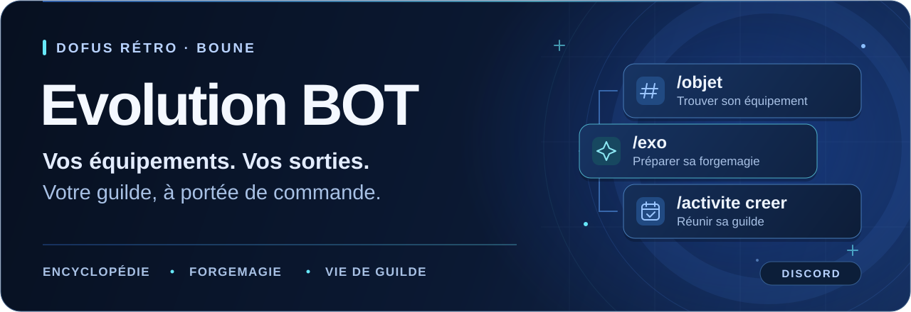

<p align="center">
  
</p>

<p align="center">
  
</p>

<p align="center">
  Le bot Discord de la guilde <strong>EVOLUTION</strong> sur <strong>Dofus Rétro — Boune</strong>.<br>
  Consulter le jeu, retrouver un artisan, préparer une sortie et faire vivre la guilde.
</p>

<p align="center">
  <a href="https://github.com/Donj63000/DiscordEVOLUTION/actions/workflows/ci.yml"></a>
  <a href="https://www.python.org/"></a>
  <a href="https://discordpy.readthedocs.io/"></a>
  <a href="LICENSE"></a>
</p>

<p align="center">
  <a href="#fonctionnalites">Fonctionnalités</a> ·
  <a href="#commandes">Commandes</a> ·
  <a href="#encyclopedie">Encyclopédie</a> ·
  <a href="#installation">Installation</a> ·
  <a href="#documentation">Documentation</a> ·
  <a href="#contribuer">Contribuer</a>
</p>

<a id="fonctionnalites"></a>
## Tout ce qu'il faut pour la guilde

| Pour… | Evolution BOT propose… |
| --- | --- |
| **Consulter Dofus Rétro** | Objets, recettes avec quantités, équipements filtrés et monstres par niveau. |
| **Trouver un artisan** | Métiers enregistrés, niveaux et recherches par joueur ou métier. |
| **Jouer ensemble** | Activités, inscriptions, calendrier, événements et sondages. |
| **Suivre les membres** | Personnages, mules, profils, classement, accueil et promotions. |
| **Accompagner le serveur** | Tickets privés, annonces, avis, modération et détection de liens dangereux. |
| **Aider le Staff** | Assistants IA, préparation de sorties et outils de gestion selon la configuration. |

Le bot s'utilise depuis le **menu `/` de Discord** ou avec le **préfixe `!`**.
Les accès Staff et les validations restent appliqués lors de l'exécution.
Les commandes des modules optionnels apparaissent lorsque ces modules sont chargés.

<a id="commandes"></a>
## Commencer dans Discord

Tape `/`, sélectionne **Evolution BOT**, puis utilise les champs proposés.
Les commandes de recherche suggèrent les noms pendant la saisie.

| Je veux… | Commande |
| --- | --- |
| Découvrir le bot | `/aide` |
| Consulter un objet | `/objet nom:Gelano` |
| Préparer trois fabrications | `/recette objet:Gelano quantite:3` |
| Chercher une coiffe jusqu'au niveau 100 | `/equipement type:Chapeau niveau:100` |
| Voir les résistances d'un monstre | `/monstre nom:Bouftou Royal` |
| Enregistrer un métier | `/job ajouter` |
| Retrouver mes métiers ou ceux d'un membre | `/job mes-metiers` · `/job joueur` |
| Ajouter mon personnage ou une mule | `/membre principal` · `/membre ajouter-mule` |
| Compléter mon profil | `/profil modifier` |
| Consulter les prochaines sorties | `/activite liste` |
| Ouvrir le calendrier du mois en cours | `/calendrier` · `/calendrier vue:semaine` |
| Contacter le Staff en privé | `/ticket` |

**Pour le Staff :** `/event` ouvre le parcours guidé en message privé ;
`/organisation`, `/annonce` et `/iastaff` accompagnent l'organisation et la gestion.
`/event-rapide` propose une sortie simple ou un vote à réactions.

Tu préfères le préfixe ? Ces exemples restent disponibles :

```text
!objet Gelano
!recette 3 Gelano
!equipement coiffe 100
!monstre Bouftou Royal
!job forgeur d'armes 100
!aide
```

<a id="encyclopedie"></a>
## L'encyclopédie Dofus Rétro

Quatre commandes donnent accès à l'[API communautaire du wiki Rétro](https://github.com/Brizze0001/dofus-retro-wiki-api),
sans clé supplémentaire.

| Commande | Dans la fiche |
| --- | --- |
| **`/objet`** | Image, type, niveau, poids, description et caractéristiques. |
| **`/recette`** | Ingrédients et quantités pour **1 à 10 000 exemplaires**. |
| **`/equipement`** | Recherche par type, niveaux minimum et maximum, et nom facultatif. |
| **`/monstre`** | PV, PA, PM et résistances pour chaque niveau renseigné. |

- **Suggestions de noms** et prise en compte des accents et des alias courants.
- **Résultats paginés**, avec choix de la fiche et retour à la page précédente.
- **Bouton de recette** depuis un objet et **formulaire pour modifier la quantité**.
- **Variantes de monstres distinguées** et lien vers leur fiche wiki.
- **Navigation réservée à l'auteur**, pendant trois minutes sans interaction.

Pour affiner une recherche :

```text
/equipement type:Chapeau niveau:100 niveau_min:40 nom:bouftou
!equipement coiffe 100 40 bouftou
!equipement "Sac à dos" 100 40 bouftou
```

Les informations absentes de la source sont signalées. Une recette non renseignée ne
signifie pas que l'objet est impossible à fabriquer. Cette intégration ne fournit pas
de prix HDV, de tables de drop ni d'inventaires de joueurs.
Les artisans restent gérés par les commandes `/job`.

<a id="installation"></a>
## Installer sa propre instance

**Prérequis :** Python **3.11 ou 3.12**, Git et une application Discord.
Ces deux versions sont vérifiées par la CI du dépôt.

```bash
git clone https://github.com/Donj63000/DiscordEVOLUTION.git
cd DiscordEVOLUTION
python -m venv .venv
```

Active l'environnement, puis installe les dépendances :

| Système | Activation |
| --- | --- |
| Windows / PowerShell | `.\.venv\Scripts\Activate.ps1` |
| Linux / macOS | `source .venv/bin/activate` |

```bash
python -m pip install -r requirements.txt
```

Copie `.env.example` vers `.env`, configure le bot Discord, les clés nécessaires,
le rôle Staff et le salon privé `#console`, puis démarre :

```bash
python main.py
```

Le [guide d'installation](docs/INSTALLATION.md) détaille les intents et permissions,
les variables d'environnement, l'identité **Evolution BOT**, ainsi que
l'hébergement **Render** et le suivi HTTP avec **UptimeRobot**.

<a id="documentation"></a>
## Comprendre et exploiter le projet

| Document | Contenu |
| --- | --- |
| [Installation et exploitation](docs/INSTALLATION.md) | Discord, environnement local, Render, UptimeRobot et dépannage. |
| [Calendrier des activités](docs/CALENDRIER.md) | Agenda, filtres, inscriptions, installation du patch et recette. |
| [Architecture et données](docs/ARCHITECTURE.md) | Modules, commandes, persistance, encyclopédie et assistants IA. |
| [Configuration d'exemple](.env.example) | Variables disponibles, sans secrets réels. |
| [Consignes de contribution](AGENTS.md) | Organisation du code, conventions et tests. |
| [CI et résultats des tests](https://github.com/Donj63000/DiscordEVOLUTION/actions/workflows/ci.yml) | Compilation et suite de tests sur chaque push et pull request. |

Les données de guilde sont sauvegardées dans **`#console`** pour être rechargées après
un redémarrage. Les catalogues du wiki utilisent un cache mémoire séparé.

<a id="contribuer"></a>
## Contribuer

Pour signaler un problème, ouvre une [issue](https://github.com/Donj63000/DiscordEVOLUTION/issues)
avec la commande utilisée, le résultat attendu et les étapes de reproduction.

Pour proposer une modification :

1. Lis les [conventions du projet](AGENTS.md).
2. Ajoute des tests ciblés pour tout changement de comportement.
3. Exécute `python -m pytest` avant de proposer la modification.
4. Conserve les données persistantes dans `#console` et les secrets hors du dépôt.

La suite couvre notamment les commandes `/` et `!`, la navigation, les recettes,
les erreurs réseau, les métiers et la persistance. Les tests utilisent des doublures ;
ils ne nécessitent pas de connexion à Discord.

## Licence et crédits

Code distribué sous [licence MIT](LICENSE). Projet de la guilde **EVOLUTION**, par
**Coca** et les contributeurs.

L'encyclopédie utilise les données du [Wiki Dofus Rétro communautaire](https://wiki.moon-bot.io/).
Dofus est une marque d'Ankama ; Evolution BOT est un projet communautaire indépendant.
