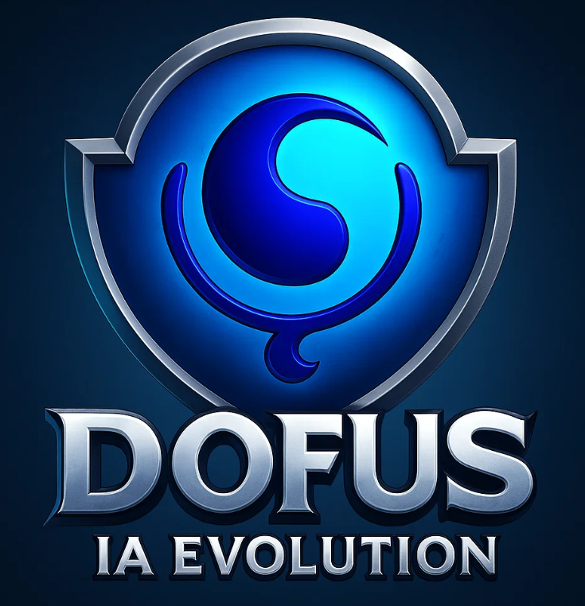
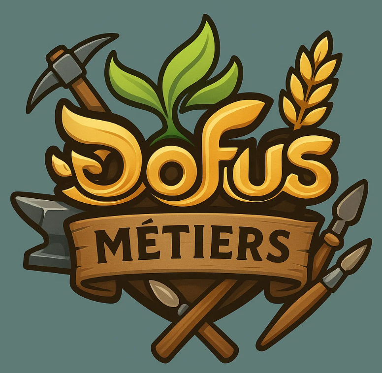

<p align="center">
  
</p>

<p align="center">
  <strong>Le bot Discord modulaire de la guilde EVOLUTION sur Dofus Retro.</strong><br>
  Accueil, moderation, tickets, activites, metiers, profils, stats et assistants IA dans une seule base de code robuste.
</p>

<p align="center">
  <a href="#demarrage-rapide"><strong>Demarrage rapide</strong></a>
  |
  <a href="#panorama"><strong>Panorama</strong></a>
  |
  <a href="#architecture"><strong>Architecture</strong></a>
  |
  <a href="#commandes-cles"><strong>Commandes cles</strong></a>
  |
  <a href="#qualite"><strong>Qualite</strong></a>
</p>

<p align="center">
  <a href="https://github.com/Donj63000/DiscordEVOLUTION/actions/workflows/ci.yml"></a>
  
  
  
</p>

## Panorama

DiscordEVOLUTION centralise les workflows critiques du serveur EVOLUTION dans un bot unique : parcours membres, moderation, tickets, annonces, organisation, metiers, profils, stats et assistance staff outillee par IA.

<table>
  <tr>
    <td width="25%">
      <strong>Community ops</strong><br>
      Welcome, depart, moderation, warnings, tickets, annonces staff et sondages dans une meme couche d'exploitation.
    </td>
    <td width="25%">
      <strong>Guild tools</strong><br>
      Activites, events, jobs, profils, ladder, promotions et stats pour piloter la vie de la guilde.
    </td>
    <td width="25%">
      <strong>AI staff</strong><br>
      <code>!organisation</code> et <code>!iastaff</code> accelerent les briefs, les reponses et certaines actions staff.
    </td>
    <td width="25%">
      <strong>Restart safe</strong><br>
      Les etats critiques sont republies dans <code>#console</code> pour survivre aux redemarrages Render.
    </td>
  </tr>
</table>

> `#console` est la source de verite en production. Les snapshots persistants y sont republies pour que le bot reparte proprement apres un redemarrage.

## Visuel du projet

<p align="center">
  
</p>

<table>
  <tr>
    <td width="33%">
      
      <strong>IA Staff</strong><br>
      Assistant staff capable de guider, raisonner et agir via ses outils quand ils sont actives.
    </td>
    <td width="33%">
      
      <strong>Jobs</strong><br>
      Gestion des metiers et niveaux, consultation par joueur ou par metier.
    </td>
    <td width="33%">
      
      <strong>Parcours membre</strong><br>
      Welcome, entree, sorties et experience serveur plus soignee.
    </td>
  </tr>
</table>

## Parcours clefs

1. Un membre peut ouvrir un ticket, recevoir un accueil propre ou etre modere selon le contexte.
2. Le staff peut preparer une activite avec `!activite`, un event via `!event` ou un brief guide via `!organisation`.
3. Les metiers, profils, promotions et stats restent consultables et persistants dans le temps.
4. Les assistants IA aident le staff a aller plus vite sans sortir du cadre du serveur.

## Architecture

```text
DiscordEVOLUTION/
|-- main.py
|-- activite.py
|-- organisation.py
|-- iastaff.py
|-- event_conversation.py
|-- job.py
|-- players.py
|-- stats.py
|-- up.py
|-- moderation.py
|-- welcome.py
|-- member_guard.py
|-- cogs/
|-- models/
|-- utils/
`-- tests/
```

### Modules qui structurent le bot

| Module | Role |
| --- | --- |
| `main.py` | Bootstrap Discord, chargement des extensions, lock singleton et wiring global du bot. |
| `organisation.py` | Parcours IA pour `!organisation`, pilotage OpenAI et publication dans le salon cible. |
| `iastaff.py` | Assistant staff, configuration du modele, outils, morning greeting et orchestration IA. |
| `event_conversation.py` | Workflow DM de `!event`, drafts, validation et persistance associee. |
| `job.py` / `players.py` / `stats.py` | Donnees de guilde, metiers, profils, recrutement et statistiques. |
| `utils/console_store.py` | Stockage structure via `#console`, charge utile cle pour la reprise apres restart. |
| `tests/` | Couverture Pytest sur le coeur du bot, les cogs, la persistance et les workflows IA. |

## Demarrage rapide

### 1. Cloner le depot

```bash
git clone https://github.com/Donj63000/DiscordEVOLUTION.git
cd DiscordEVOLUTION
```

### 2. Installer les dependances

```bash
pip install -r requirements.txt
```

### 3. Preparer l environnement

Copiez `.env.example` vers `.env` puis renseignez vos secrets.

Variables minimales :

| Variable | Usage |
| --- | --- |
| `DISCORD_TOKEN` | Token du bot Discord. |
| `FERNET_KEY` | Cle de chiffrement pour les donnees sensibles. |
| `OPENAI_API_KEY` | Requise pour `!organisation` et les usages OpenAI. |
| `GOOGLE_API_KEY` | Requise pour les usages Gemini selon le backend choisi. |

Generation rapide de `FERNET_KEY` :

```bash
python -c "from cryptography.fernet import Fernet; print(Fernet.generate_key().decode())"
```

### 4. Lancer le bot

```bash
python main.py
```

## Configuration et persistance

Le projet est pense pour une exploitation reelle sur Discord, pas juste pour du test local.

| Zone | Ce qu il faut savoir |
| --- | --- |
| `#console` | C est la source de verite pour les donnees critiques. Utilisez les helpers de persistance au lieu d inventer des fichiers ad hoc. |
| IA Staff | `IASTAFF_ENABLE_TOOLS=1` permet a l assistant d agir via son catalogue d outils. |
| Organisation | Les variables `ORGANISATION_*` reglent le backend, les timeouts et les parametres de planification. |
| Stockage | `DATABASE_URL` peut etre active pour certains usages, sinon le fallback par console reste la reference. `JOB_ALLOW_LOCAL_FALLBACK=1` autorise explicitement un secours local pour `jobs_data.json` en cas de console vide/indisponible. |
| Secrets | Aucun token, cache runtime ou donnees sensibles ne doit etre committe. |

Snapshots locaux typiques :

- `activities_data.json`
- `jobs_data.json`
- `players_data.json`
- `profiles_data.json`
- `promotions_data.json`
- `stats_data.json`
- `warnings_data.json`
- `welcome_data.json`

## Commandes cles

### Menu Discord avec `/`

Toutes les commandes des modules charges disposent d'un acces dans le menu `/`.
Tapez `/` dans un salon du serveur, selectionnez **Evolution BOT**, puis utilisez les
champs proposes. Les commandes historiques avec `!` restent disponibles et utilisent
les memes validations, permissions, cooldowns et sauvegardes dans `#console`.

| Commande slash | Utilisation |
| --- | --- |
| `/aide` | Guides et exemples pour demarrer. |
| `/objet`, `/recette` | Fiche d'objet et ingrédients multipliés par la quantité demandée. |
| `/equipement`, `/monstre` | Équipements par type, tranche de niveaux et nom ; bestiaire par niveau. |
| `/job ajouter` | Metier avec suggestions, puis niveau entre 1 et 100. |
| `/job mes-metiers`, `/job joueur` | Vos metiers ou ceux du membre selectionne. |
| `/membre principal`, `/membre ajouter-mule` | Personnage principal et mules. |
| `/profil modifier`, `/profil voir` | Parcours guide et consultation de profils. |
| `/profil importer` | Importer les `%stats%` depuis le lien ou l'ID d'un message du salon courant. |
| `/activite creer`, `/activite rejoindre` | Champs separes pour l'activite et suggestions d'identifiants. |
| `/sondage` | Question, choix separes par `|`, duree optionnelle `JJ:HH:MM`. |
| `/event` | Meme parcours prive et persistant que `!event`, reserve au Staff. |
| `/event-rapide` | Ancien `/event` : sortie simple ou vote a reactions. |
| `/organisation`, `/annonce`, `/perco` | Formulaires et commandes slash deja disponibles. |
| `/stats`, `/accueil`, `/clear` | Sous-commandes expliquees directement dans Discord. |

Les commandes des modules optionnels apparaissent seulement si ces modules sont charges.
Les restrictions Staff restent controlees lors de l'execution. Le Staff peut aussi regler
leur visibilite dans **Parametres du serveur > Integrations > Evolution BOT**.

### Encyclopédie Dofus Rétro

Les quatre recherches utilisent l'[API communautaire du wiki Rétro](https://github.com/Brizze0001/dofus-retro-wiki-api),
sans clé supplémentaire. Les noms sont suggérés pendant la saisie. Les résultats multiples
et les équipements disposent d'un menu de sélection et de pages, sans plafond silencieux
de 100 résultats. Les variantes de monstres sont distinguées dans les suggestions.
Les fiches permettent de revenir à la page de résultats précédente ; les objets proposent
leur recette et un formulaire pour modifier la quantité, entre 1 et 10 000 exemplaires.
La navigation est réservée à l'auteur et expire après trois minutes sans interaction,
puis les liens vers le wiki restent utilisables.

Exemples : `/objet nom:Gelano`, `/recette objet:Gelano quantite:3`,
`/equipement type:Chapeau niveau:100`, `/monstre nom:Bouftou Royal`.
Les champs facultatifs `niveau_min` et `nom` précisent la recherche d'équipements :
`/equipement type:Chapeau niveau:100 niveau_min:40 nom:bouftou`.
Les variantes avec `!` restent disponibles : `!objet Gelano`, `!recette 3 Gelano`,
`!recette Gelano`, `!equipement coiffe 100`, `!monstre Bouftou Royal`.
Pour les mêmes filtres : `!equipement coiffe 100 40 bouftou`.
Les catégories de plusieurs mots doivent être entre guillemets avec `!`, par exemple
`!equipement "Sac à dos" 100 40 bouftou`. Les synonymes courants, comme « coiffe »,
« bottes » et « dagues », sont également proposés dans les suggestions slash.

Les catalogues sont préchargés sans bloquer le démarrage. Les suggestions consultent
uniquement le cache mémoire. Pendant son chargement, un nom déjà saisi peut être validé
pour lancer la recherche directement. `DOFUS_WIKI_CACHE_TTL=3600` règle sa durée et
`DOFUS_WIKI_TIMEOUT=10` borne chaque requête HTTP. Les téléchargements identiques sont
partagés, avec deux requêtes simultanées maximum. En cas de panne, une copie en cache de
moins de 24 heures reste consultable et est signalée comme telle. Aucun catalogue du wiki
ni aucune donnée de guilde ne sont écrits dans un nouveau fichier local.

Les identifiants de l'index des monstres ne sont pas fiables : le bot suit le lien JSON
de la fiche choisie puis vérifie son URL, son nom et son identifiant. Les caractéristiques
manquantes restent indiquées comme non renseignées. Une recette vide signifie qu'elle
n'est pas renseignée, sans conclure que l'objet est impossible à fabriquer. Cette source
ne fournit pas de prix HDV, de tables de drop ou d'inventaires de joueurs.
Les objets sans niveau restent consultables par nom ; ils ne sont pas inclus dans
un filtre de niveau d'équipement faute de pouvoir vérifier ce critère.

### Activation et identite Discord

1. Deployer les fichiers, dont `assets/evolution-bot.png`, puis redemarrer le bot.
2. Garder `SYNC_SLASH_COMMANDS=1` (valeur par defaut). Pour un serveur de developpement,
   renseigner `SYNC_SLASH_GUILD_ID` ; sinon laisser vide pour les commandes globales.
3. Verifier que l'installation du bot autorise les scopes `bot` et `applications.commands`,
   et que les membres ont la permission **Utiliser les commandes d'application**.
4. Dans **Discord Developer Portal > application > General Information**, definir le nom
   de l'application a **Evolution BOT**. Ce nom n'est pas modifiable par l'API du bot.

Avec `SYNC_BOT_IDENTITY=1`, le bot applique automatiquement son nom d'utilisateur
`BOT_DISPLAY_NAME=Evolution BOT`, son avatar et l'icone de l'application a partir de
`BOT_AVATAR_PATH=assets/evolution-bot.png`, apres acquisition du verrou de l'instance active.
Le logo fourni est conserve sans modification. Les empreintes appliquees sont conservees
dans le snapshot `===BOTBRANDING===` de `#console`, afin de ne pas reenvoyer les images
a chaque redemarrage. Ce snapshot est protege par `/clear console`.
La synchronisation de l'identite est reportee si `#console` est indisponible ; une erreur
d'avatar ou d'icone n'empeche pas les commandes de fonctionner.

Le nom et l'icone affiches a cote des commandes sont geres par Discord a partir de
l'identite de l'application et du bot, pas par les descriptions des commandes.
La propagation des commandes globales et de l'identite peut prendre un delai cote Discord.

References : [commandes d'application](https://docs.discord.com/developers/interactions/application-commands),
[identite de l'application](https://docs.discord.com/developers/resources/application),
[nom du bot](https://support-dev.discord.com/hc/en-us/articles/6129090215959-How-Do-I-Change-My-Bot-s-Name).

### Commandes avec le prefixe `!`

| Commande | Ce que ca fait |
| --- | --- |
| `!ticket <objet>` | Ouvre un ticket prive et organise l echange staff. |
| `!annonce`, `!annoncestaff`, `!sondage` | Gere la diffusion publique, staff et les votes. |
| `!activite` | Lance un workflow de planification d activite. |
| `!organisation` | Produit un brief evenementiel guide par IA. |
| `!event` | Cree un event avec un parcours DM structure. |
| `!job <metier> <niveau>` | Ajoute ou met a jour un metier pour un joueur. |
| `!profil set`, `!profil stats`, `!ladder` | Met a jour les profils et consulte les stats serveur. |
| `!iastaff <message>` | Interagit avec l assistant staff et ses outils. |
| `!warnings`, `!resetwarnings`, `!up` | Gere la moderation et la progression. |

## Qualite

Le depot est outille pour tenir dans la duree :

- CI GitHub Actions sur `push` et `pull_request`
- compilation des sources Python dans la pipeline
- suite `pytest` complete sur les workflows critiques
- tests autour de l IA, de la persistance et des commandes principales

Commande de validation locale :

```bash
python -m pytest
```

## Deploiement

Execution locale :

```bash
python main.py
```

Keep alive / Render :

```bash
gunicorn alive:app --bind 0.0.0.0:$PORT
```

Si besoin, `ALIVE_IN_PROCESS=1` permet de faire tourner le bot et le keep alive dans un meme processus local.

## Contribution

- Travaillez avec des tests qui passent avant chaque push.
- Ajoutez des tests cibles a chaque evolution comportementale.
- Gardez `#console` comme autorite de persistance.
- N ajoutez ni secrets, ni caches, ni exports runtime au depot.

## Licence

Projet distribue sous licence [MIT](LICENSE).
