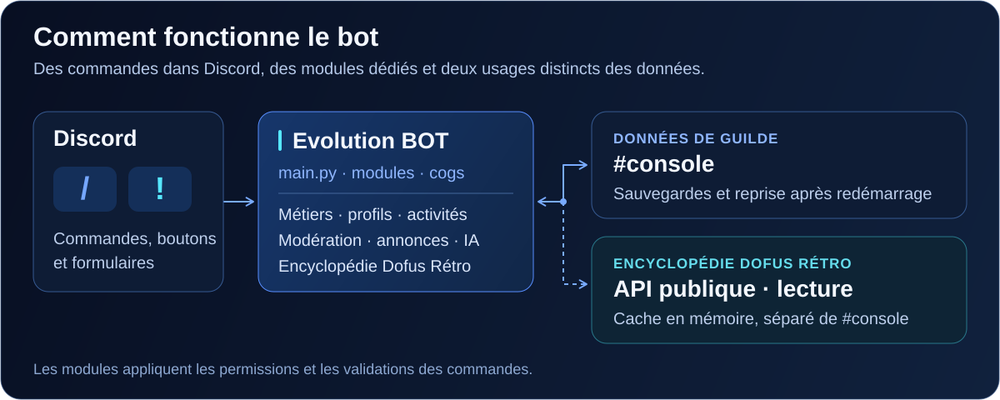

# Architecture et données

[Retour au README](../README.md)

<p align="center">
  
</p>

## Organisation du code

| Fichier ou dossier | Responsabilité |
| --- | --- |
| [`main.py`](../main.py) | Client Discord, intents, chargement des extensions, synchronisation slash et verrou d'instance. |
| [`slash_commands.py`](../slash_commands.py) | Enregistrement des commandes et de leurs champs dans le menu Discord. |
| [`utils/slash_catalog.py`](../utils/slash_catalog.py) | Noms, descriptions, options et correspondances avec les commandes existantes. |
| [`utils/slash_support.py`](../utils/slash_support.py) | Contexte d'exécution slash, contrôles, conversions, cooldowns et réponses. |
| [`dofus_wiki.py`](../dofus_wiki.py) | Commandes objet, recette, équipement et monstre ; menus et formulaires. |
| [`utils/dofus_wiki.py`](../utils/dofus_wiki.py) | Accès à l'API du wiki, recherche, cache et validation des fiches. |
| [`utils/wiki_embeds.py`](../utils/wiki_embeds.py) | Fiches Discord, quantités et présentation des données manquantes. |
| [`job.py`](../job.py), [`players.py`](../players.py), [`cogs/profil.py`](../cogs/profil.py) | Métiers, personnages, mules, profils et classement. |
| [`activite.py`](../activite.py), [`event_conversation.py`](../event_conversation.py), [`organisation.py`](../organisation.py) | Activités, inscriptions et préparation d'événements. |
| [`iastaff.py`](../iastaff.py), [`cogs/annonce_ai.py`](../cogs/annonce_ai.py), [`ia.py`](../ia.py) | Assistants et parcours IA. |
| [`defender.py`](../defender.py), [`moderation.py`](../moderation.py), [`ticket.py`](../ticket.py) | Liens, modération et échanges privés avec le Staff. |
| [`stats.py`](../stats.py), [`welcome.py`](../welcome.py), [`up.py`](../up.py) | Statistiques, accueil et promotions. |
| [`utils/`](../utils), [`models/`](../models) | Helpers partagés et modèles de données. |
| [`tests/`](../tests) | Tests avec services externes simulés. |

Le module d'organisation utilisé est **[`organisation.py` à la racine](../organisation.py)**.
L'ancien `cogs/organisation.py` est un vestige qui lève volontairement `ImportError`.

## Parcours d'une commande

Pour les commandes adaptées au menu slash, les options Discord sont converties vers
le traitement existant. Les contrôles globaux, permissions, conversions, cooldowns et
hooks sont conservés. Les commandes déjà natives en slash restent enregistrées dans
l'arbre Discord.

Le catalogue est chargé après les modules métier. Une vérification détecte les commandes
préfixées chargées qui n'auraient pas de correspondance slash.
Les interactions qui attendent une opération longue sont acquittées avant ce traitement.

<a id="persistance"></a>
## Persistance

**`#console` est la référence pour les données de guilde.** Les modules y publient des
snapshots structurés et les rechargent après redémarrage, via
[`utils/console_store.py`](../utils/console_store.py) et les helpers adaptés à chaque domaine.

Quelques distinctions utiles :

| Données | Conservation |
| --- | --- |
| Métiers, personnages, activités et autres états de guilde | Snapshots dans `#console`, selon le module. |
| Verrou de l'instance active | Message `===BOTLOCK===` dans `#console`. |
| Empreintes de l'identité du bot | Snapshot `===BOTBRANDING===` dans `#console`. |
| Catalogues et fiches du wiki | Cache mémoire borné, rechargé depuis l'API publique. |
| Historique local Defender | Base locale chiffrée si une clé Fernet est configurée. |

Certains modules conservent aussi des caches ou exports locaux. Ils ne remplacent pas
les snapshots Discord et ne doivent pas être versionnés. Pour les métiers,
`JOB_ALLOW_LOCAL_FALLBACK=1` autorise explicitement le secours local prévu par ce module ;
la valeur d'exemple reste `0`.

L'option `DATABASE_URL` concerne `EventStore`. Sans cette variable, ce store utilise la
console. Si elle est renseignée mais que PostgreSQL est inaccessible, l'initialisation
échoue : il n'y a pas de bascule automatique vers la console. Cette option n'est pas
requise pour l'encyclopédie et ne transforme pas l'ensemble du bot en stockage SQL.

## Encyclopédie communautaire

L'intégration consulte l'[API Dofus Rétro](https://github.com/Brizze0001/dofus-retro-wiki-api) :

- catalogues d'objets et de monstres ;
- index d'icônes ;
- fiches d'objets et recettes ;
- fiche du monstre choisi, puis son lien JSON.

Les identifiants du catalogue des monstres ne suffisent pas à identifier une variante.
Le client suit la fiche sélectionnée et vérifie son URL, son nom et son identifiant
avant d'afficher ses statistiques.

Le client limite les accès simultanés à deux et partage les téléchargements identiques.
Le délai HTTP inclut l'attente d'une place disponible. Les réponses ont une taille maximale
et les adresses consultées sont limitées à l'origine du wiki.

Le cache frais dure une heure par défaut. En cas de panne, une copie de moins de
24 heures peut être affichée avec une indication explicite. Les réponses 429 déclenchent
une attente tenant compte de `Retry-After`. Les catalogues démarrent leur chargement en
arrière-plan et l'autocomplétion consulte le cache.

Les résultats de recherche sont paginés sans plafond silencieux de 100 correspondances ;
les suggestions de l'autocomplétion sont limitées à 25. Les approximations sont présentées
comme des suggestions. Les données manquantes restent visibles comme telles, notamment
pour les statistiques et les résistances partielles.

Les boutons, formulaires et remplacements de menus prennent en charge l'expiration,
les erreurs de publication et la conservation de la page et de la quantité.
Les liens vers le wiki restent utilisables après l'expiration de la navigation.

## Assistants IA

Les services IA dépendent du backend configuré et de sa clé :

- `organisation.py` prépare une sortie via son parcours guidé.
- `event_conversation.py` reste responsable du parcours privé de `!event` et `/event`,
  avec Gemini via `IACog`.
- `iastaff.py` expose une assistance réservée au Staff ; ses outils sont activés par
  `IASTAFF_ENABLE_TOOLS=1`.
- Les parcours OpenAI utilisent les helpers de [`utils/openai_config.py`](../utils/openai_config.py)
  pour résoudre les alias de modèles.

Les outils de gestion utilisent les cogs et leurs helpers de persistance.
Les réglages de modèles, de délais et de backends sont décrits dans
[`.env.example`](../.env.example) et dans les modules concernés.

## Tests et CI

```bash
python -m pytest
```

La [CI GitHub Actions](../.github/workflows/ci.yml) s'exécute sur les pushes et pull requests,
avec Python 3.11 et 3.12. Elle compile les sources, exécute la suite avec les marqueurs
stricts et publie des rapports de tests et de couverture.

Les tests ne publient pas de vrais messages Discord. Les clients et réseaux sont simulés
pour vérifier les erreurs, la persistance, les conversions et les parcours utilisateur.
La manipulation sur un serveur de test complète ces vérifications avant un déploiement.

Voir les [consignes de contribution](../AGENTS.md) avant d'ajouter un module ou une commande.
